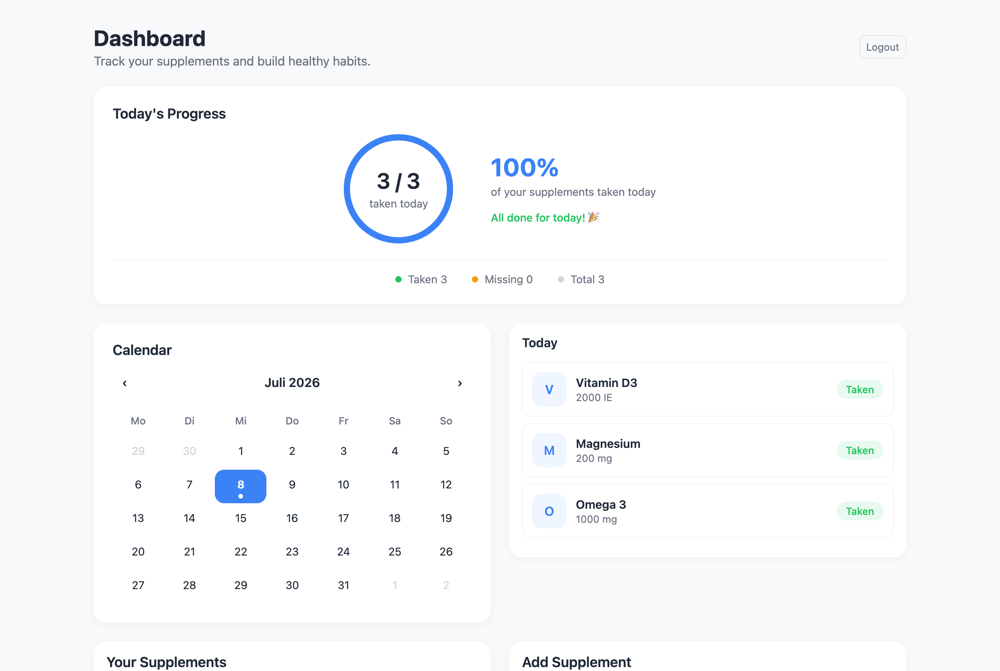

# Supplement Tracker

A full-stack web app for tracking daily supplement intake. Log what you take, see your progress for the day at a glance, and review your consistency on a calendar — the greener the dot, the more complete the day.



## Features

- **Daily progress ring** — see how many of your supplements you have taken today, with a live percentage and remaining count
- **One-click logging** — mark a supplement as taken (or undo it) directly from your supplement list
- **Calendar history** — every day shows a dot whose intensity reflects how many supplements were logged; click any day to see its intakes
- **Supplement management** — add supplements with name and dosage, delete them (their intake history is cleaned up automatically)
- **Accounts & auth** — registration and login with JWT-based sessions, protected routes, and automatic logout when the session expires
- **Server-side validation** — email format, password strength, and required fields are enforced by the API, not just the form

## Tech Stack

| Layer | Technology |
|---|---|
| Frontend | React 19, React Router 7, Axios, Vite |
| Backend | Node.js, Express 5 |
| Database | PostgreSQL (`pg` driver, parameterized queries) |
| Auth | JWT (`jsonwebtoken`), bcrypt password hashing |

No UI framework — the design system is hand-written CSS with custom properties.

## Getting Started

### Prerequisites

- Node.js 20+
- PostgreSQL 14+

### 1. Database

```bash
createdb supplement_tracker
psql -d supplement_tracker -f backend/db/schema.sql
```

### 2. Backend

```bash
cd backend
cp .env.example .env   # fill in your DB credentials and a JWT secret
npm install
npm run dev            # starts on http://localhost:5001
```

### 3. Frontend

```bash
cd frontend
npm install
npm run dev            # starts on http://localhost:5173
```

Open http://localhost:5173, register an account, and start tracking.

## API Overview

All `/api/supplements` and `/api/intake` routes require a `Bearer` token.

| Method | Route | Description |
|---|---|---|
| POST | `/api/auth/register` | Create an account (validates email format and password strength) |
| POST | `/api/auth/login` | Log in, returns a JWT (expires after 1 day) |
| GET | `/api/supplements` | List the user's supplements |
| POST | `/api/supplements` | Add a supplement |
| DELETE | `/api/supplements/:id` | Delete a supplement and its intake logs |
| GET | `/api/intake/:date` | Intakes for a specific day (`YYYY-MM-DD`) |
| GET | `/api/intake/month/:month` | Intakes for a month (`YYYY-MM`), used for the calendar dots |
| POST | `/api/intake` | Log an intake (409 if already logged that day) |
| DELETE | `/api/intake/:id` | Undo an intake |

## Challenges & Learnings

Things that broke along the way and what they taught me:

- **The timezone bug.** Dates picked in the calendar were saved as the *previous* day. `Date.toISOString()` converts to UTC, so local midnight in UTC+2 becomes 22:00 of the day before. Fix: a shared `formatLocalDate()` helper that formats dates from local components, plus `TO_CHAR(date, 'YYYY-MM-DD')` in SQL so dates travel as plain strings end to end.
- **Duplicate protection belongs in the database.** Disabling the "Take" button doesn't stop a direct API call from logging a supplement twice. A `UNIQUE (user_id, supplement_id, date)` constraint does — the API catches Postgres error `23505` and answers with `409`.
- **Axios interceptors are just middleware.** Instead of attaching the auth header in every request by hand, a request interceptor adds it centrally — the client-side mirror of the Express auth middleware. A response interceptor catches expired sessions (401) and redirects to login, with an exception for the auth routes so failed logins still show their error message.
- **Frontend validation is comfort, backend validation is protection.** Anything the form checks can be bypassed with `curl`. Presence and format checks (regex) live in the controllers and reject bad requests with `400` before they reach bcrypt or the database.

## Roadmap

- Supplement catalog with autocomplete suggestions and automatic dosage units
- API tests (Jest + Supertest)
- Deployment with a public demo
